# Recallify - Instruction and Development Manual

## Table of Contents

[Development Structure](#development-structure)
[The features](#the-features)

* [Dashboard](#1-dashboard)
* [Daily Diary](#2-daily-dairy)
* [Side Quest](#3-side-quest)
* [Think Fast](#4-think-fast)
* [Main Settings](#5-main-settings)

[Download the Application](#downloading-the-application)

* [Application Download](#1-using-the-application-release-apk)
* [Application IDE tooling](#2-using-the-ide-tool)

## Development Structure

The application's stable version structure is described in the following tree.

```markdown
Recallify
├── .gradle
│   └── gradle components files
├── .idea
│   └── idea component files
├── app
│   ├── build
│   ├── release
│   ├── sampledata
│   ├── manifests
│   └── src
│       ├── androidTest
│       │   └── Application test components
│       ├── main
│       │   ├── java
│       │   │   └── com
│       │   │       └── example
│       │   │           └── recallify
│       │   │               └── view
│       │   │                   ├── common
│       │   │                   │   ├── components
│       │   │                   │   │   ├── CustomFaq.kt
│       │   │                   │   │   ├── CustomHeader.kt
│       │   │                   │   │   ├── ImagePreview.kt
│       │   │                   │   │   ├── LoadingAnimation.kt
│       │   │                   │   │   ├── ProgressBar.kt
│       │   │                   │   │   └── TabDiary.kt
│       │   │                   │   ├── function
│       │   │                   │   │   └── DatePicker.kt
│       │   │                   │   └── resources
│       │   │                   │       ├── AccountsTopAppBar.kt
│       │   │                   │       ├── BottomBarFiller.kt
│       │   │                   │       ├── DailyDiaryTopAppBar.kt
│       │   │                   │       ├── DashboardTopAppBar.kt
│       │   │                   │       ├── DiaryActivityTopAppBar.kt
│       │   │                   │       ├── SideQuestTopAppBar.kt
│       │   │                   │       └── ThinkFastTopAppBar.kt
│       │   │                   └── ui
│       │   │                       ├── feature
│       │   │                       │   ├── application
│       │   │                       │   │   ├── dailydiary
│       │   │                       │   │   │   └── conversationSummary
│       │   │                       │   │   │       ├── ConfirmScreenSummarizeConversation
│       │   │                       │   │   │       └── SummarizeConversation
│       │   │                       │   │   └── tbi_applications
│       │   │                       │   │       ├── accounts
│       │   │                       │   │       │   └── AccountsActivity.kt
│       │   │                       │   │       ├── dailydiary
│       │   │                       │   │       │   ├── daily_activity
│       │   │                       │   │       │   │   └── DailyActivity.kt
│       │   │                       │   │       │   ├── moment_snap
│       │   │                       │   │       │   │   ├── CameraView.kt
│       │   │                       │   │       │   │   └── MomentSnapActivity.kt
│       │   │                       │   │       │   └── DailyDiaryActivity.kt
│       │   │                       │   │       ├── dashboard
│       │   │                       │   │       │   └── DashboardActivity.kt
│       │   │                       │   │       ├── sidequest
│       │   │                       │   │       │   └── SidequestActivity.kt
│       │   │                       │   │       ├── tbimainsettings
│       │   │                       │   │       └── thinkfast
│       │   │                       │   ├── guardian_application
│       │   │                       │   │   ├── guardian_account
│       │   │                       │   │   │   └── GuardianAccountsActivity.kt
│       │   │                       │   │   ├── guardiandailydiary
│       │   │                       │   │   │   └── GuardianDailyDiaryActivity.kt
│       │   │                       │   │   ├── guardiandashboard
│       │   │                       │   │   │   └── GuardianDashboardActivity.kt
│       │   │                       │   │   ├── guardiansidequest
│       │   │                       │   │   │   ├── GuardianSideQuestActivity.kt
│       │   │                       │   │   │   └── other guardian side quest related files
│       │   │                       │   │   ├── guardianthinkfast
│       │   │                       │   │   │   ├── GuardianThinkFast.kt
│       │   │                       │   │   │   └── other guardian think fast related files
│       │   │                       │   │   └── mainsettingspage
│       │   │                       │   │       ├── GuardianFactsAndQuestions.kt
│       │   │                       │   │       ├── GuardianMainSettings.kt
│       │   │                       │   │       ├── HelpAndSupport.kt
│       │   │                       │   │       ├── PrivacyAndSecurity.kt
│       │   │                       │   │       └── TermsAndConditions.kt
│       │   │                       │   └── security
│       │   │                       │       ├── forgotpassword
│       │   │                       │       │   └── ForgotPasswordActivity.kt
│       │   │                       │       ├── signin
│       │   │                       │       │   └── LoginActivity.kt
│       │   │                       │       └── signup
│       │   │                       │           └── RegisterActivity.kt
│       │   │                       └── theme
│       │   │                           ├── modules
│       │   │                           ├── Color.kt
│       │   │                           ├── Shape.kt
│       │   │                           ├── Theme.kt
│       │   │                           └── Tyoe.kt
│       │   └── res
│       │       ├── anim
│       │       │   └── Screen animation files
│       │       ├── drawables
│       │       │   └── Application vector and image assets
│       │       ├── font
│       │       │   └── Application fonts
│       │       ├── layout
│       │       │   └── Application screens
│       │       ├── menu
│       │       │   └── bottom_menu.xml
│       │       ├── mipmap
│       │       │   └── Application launcher files for different screens
│       │       ├── values
│       │       │   ├── colors
│       │       │   ├── application logo and icons
│       │       │   └── strings.xml
│       │       └── xml
│       │           ├── backup files 
│       │           └── data extraction files
│       └── test [unitTest]
│           └── Unit test cases components
├── build
│   └── build configuration files
├── gradle
│   └── gradle build component files
├── .gitignore
├── build.gradle
├── desktop.ini
├── gradle.properties
├── gradlew
├── gradlew.bat
├── local.properties
├── ReadMe.md
└── settings.gradle
External Libraries
└── External library components files
Scratches and Consoles
└── Sratches and Consoles component files
```

## The features

This is a manual guide on how to use the application features and what to expect from the
application.

### 1. Dashboard

The dashboard is the hub of the application and holds the information of the whole application of
the
user. The latest activity, Think fast progress reports, and Side Quest progress reports. The only
difference between the TBI and Guardian dashboard is that Guardian dashboard has the option to view
the TBI user's location and pin-point it on the map.

<table>
    <tr>
        <th colspan="1">TBI View</th>
        <th colspan="1">Guardian View</th>
    </tr>
    <tr>
        <td>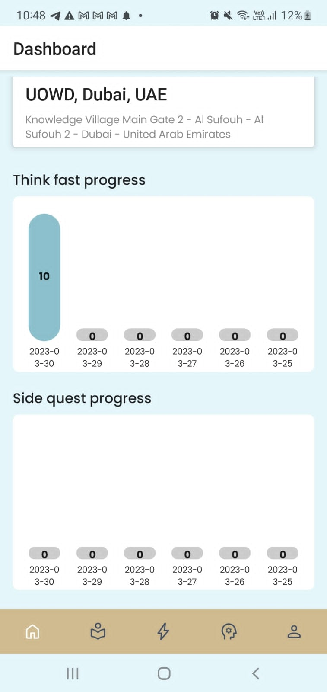</td>
        <td>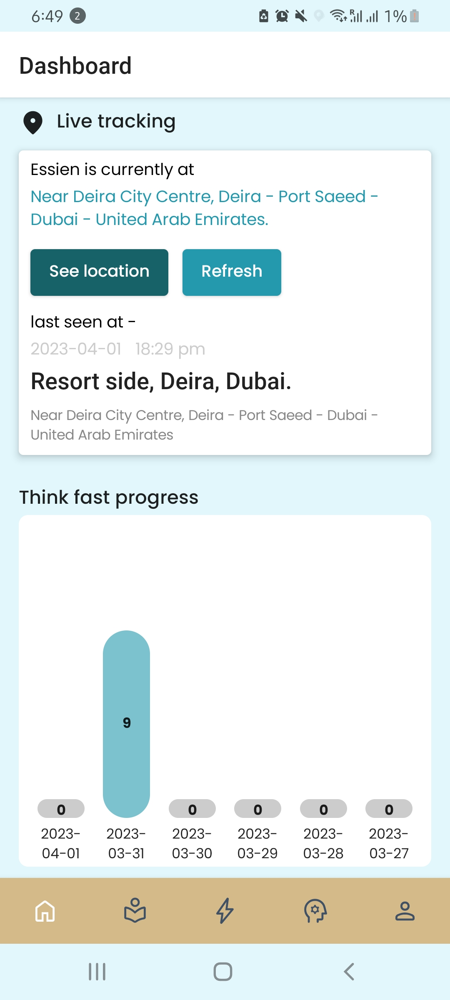</td>
    </tr>
</table>

### 2. Daily Dairy

The center of remembering and creating for the user. Here is the source of creating a conversation
summary, daily activity and moment snap. Each component is used to support one another and help with
creating unique events for the user.

<table>
    <tr><th colspan="2">TBI View</th></tr>
    <tr><th colspan="2">Daily Diary Feed</th></tr>
    <tr><th>Daily Activities</th><th>Daily Logs</th></tr>
    <tr>
        <td>
            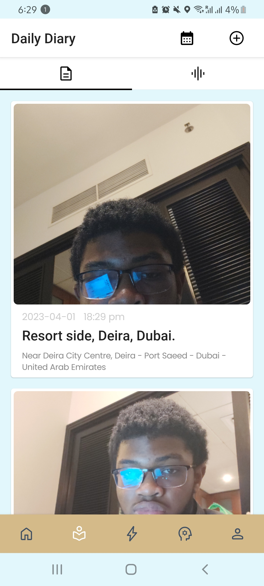
        </td>
        <td>
            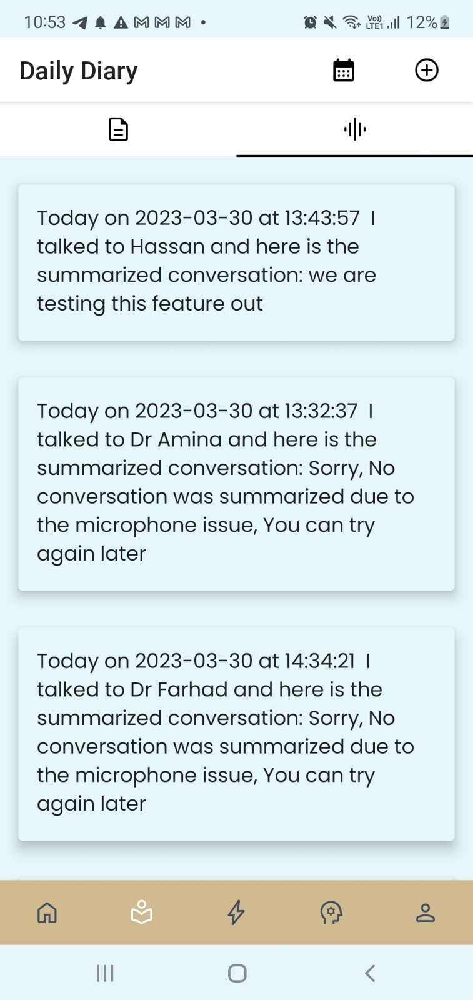
        </td>
    </tr>
</table>
The difference TBI and Guardian Daily Diary feed is the the Guardian does not have the option to 
create. They can only monitor the activities or summarized conversations that the TBI have.
<table>
    <tr><th colspan="2">Guardian View</th></tr>
    <tr><th colspan="2">Daily Diary Feed</th></tr>
    <tr><th>Daily Activities</th><th>Daily Logs</th></tr>
    <tr>
        <td>
            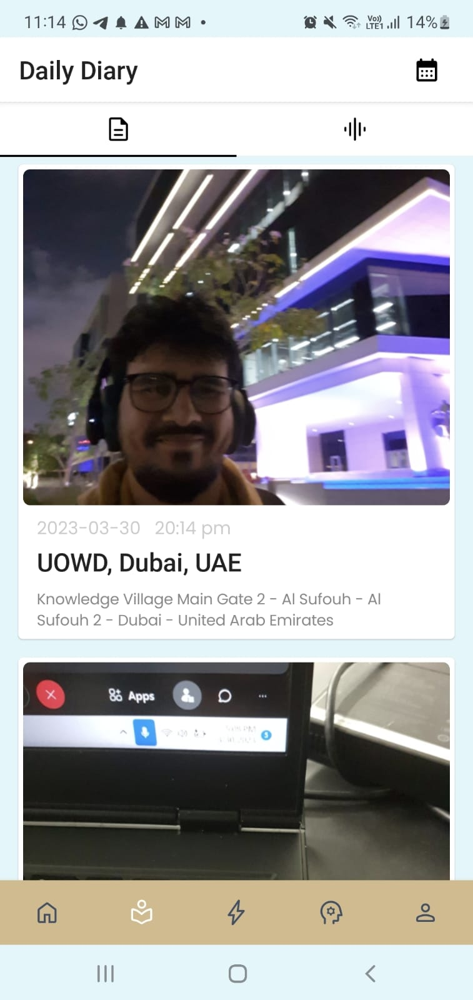
        </td>
        <td>
            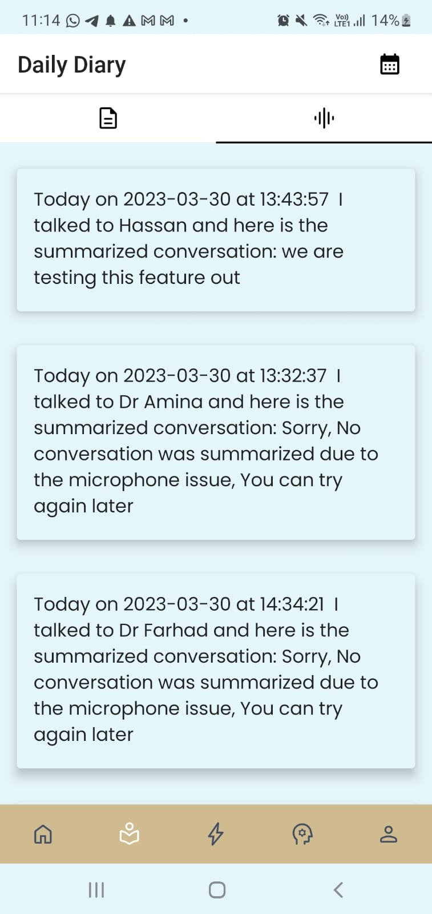
        </td>
    </tr>
</table>

### 3. Side Quest

A recalling exercise that incorporates the activities used in the daily diary feature to prompt the
user questions on what happened on that day or the name of the location.
<table>
    <tr>
        <th colspan="3">TBI View</th>
    </tr>
    <tr>
        <th>Home screen</th>
        <th>View Result</th>
        <th>View Analysis</th>
    </tr>
    <tr>
        <td>
            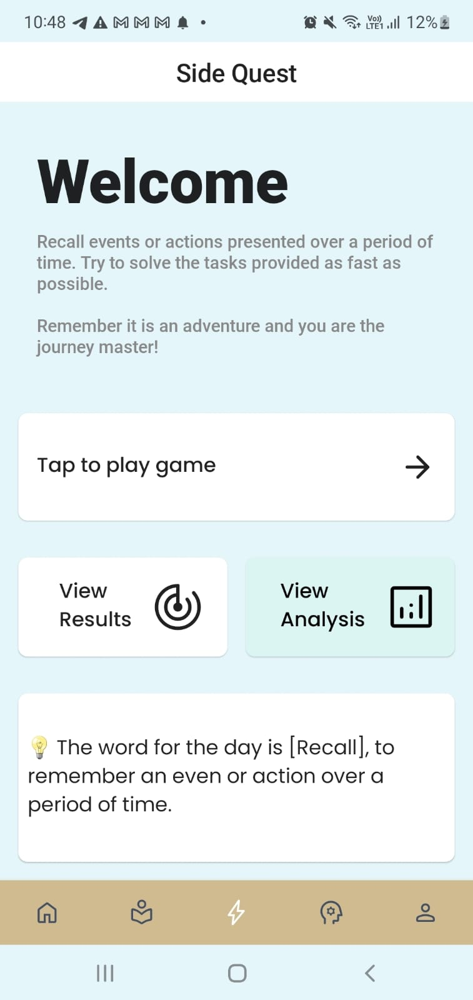
        </td>
        <td>
            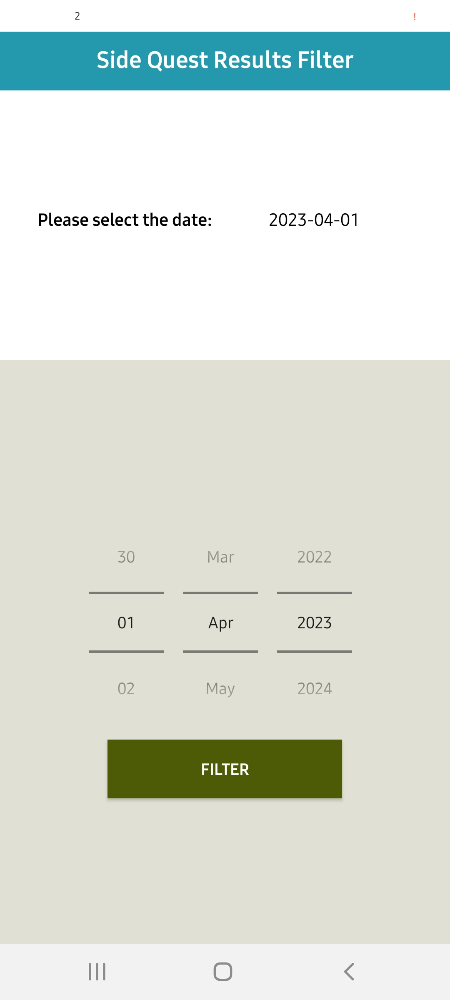
        </td>
        <td>
            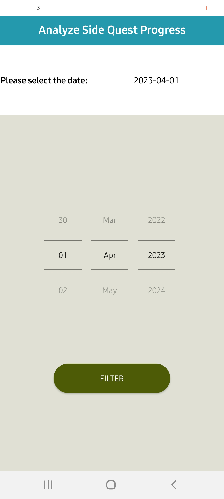
        </td>
    </tr>
</table>
The difference between the TBI and Guardian views for Side quest is that the Guardian cannot 
play the exercise.
<table>
    <tr>
        <th colspan="3">Guardian View</th>
    </tr>
    <tr>
        <td>
            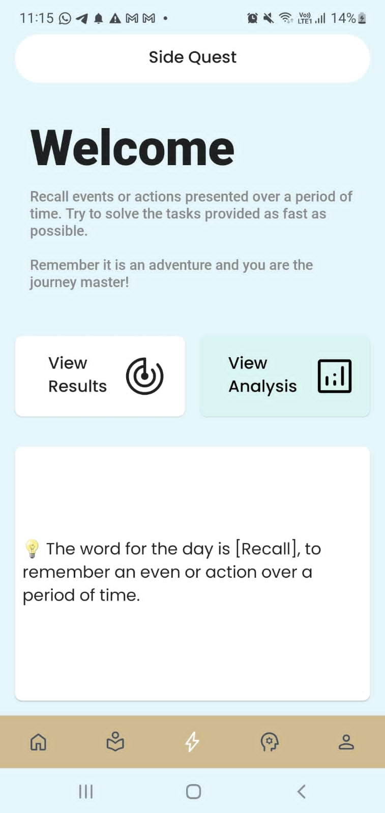
        </td>
    </tr>
</table>

### 4. Think Fast

A variation recalling exercise that prompts different images and based on the images you have to
remember the difference between the image and the questions asked.
<table>
    <tr>
        <th colspan="3">TBI View</th>
    </tr>
    <tr>
        <th>Home screen</th>
        <th>View Result</th>
        <th>View Analysis</th>
    </tr>
    <tr>
        <td>
            
        </td>
        <td>
            
        </td>
        <td>
            
        </td>
    </tr>
</table>
The difference between the TBI and Guardian views for Think fast is that the Guardian cannot 
play the exercise.
<table>
    <tr>
        <th colspan="3">Guardian View</th>
    </tr>
    <tr>
        <td>
            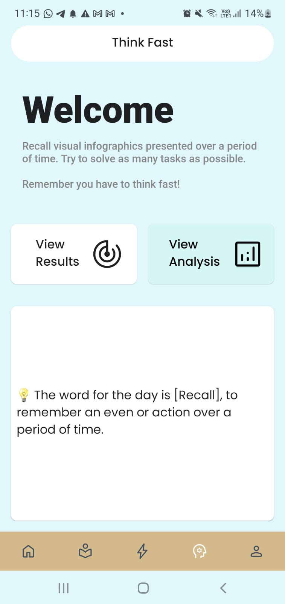
        </td>
    </tr>
</table>

### 5. Main Settings

<table>
    <tr>
        <th colspan="2">TBI View</th>
        <th colspan="2">Guardian View</th>
    </tr>
    <tr>
        <th>Main Settings</th>
        <th>Account Settings</th>
        <th>Main Settings</th>
        <th>Account Settings</th>
    </tr>
    <tr> 
        <td>
            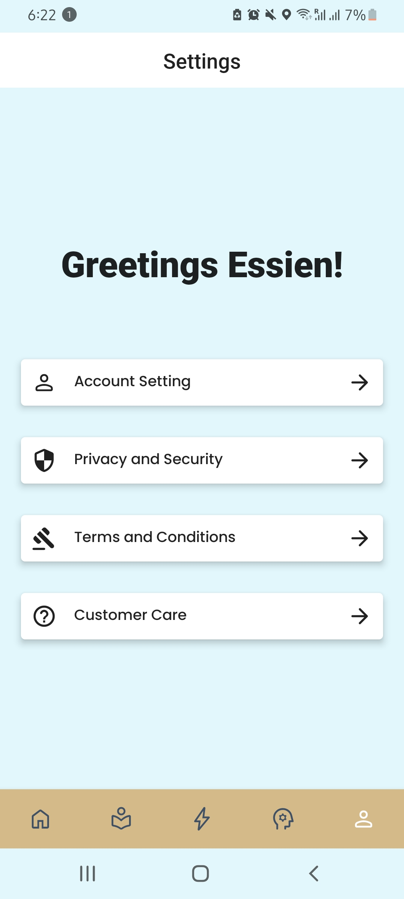
        </td>
        <td>
            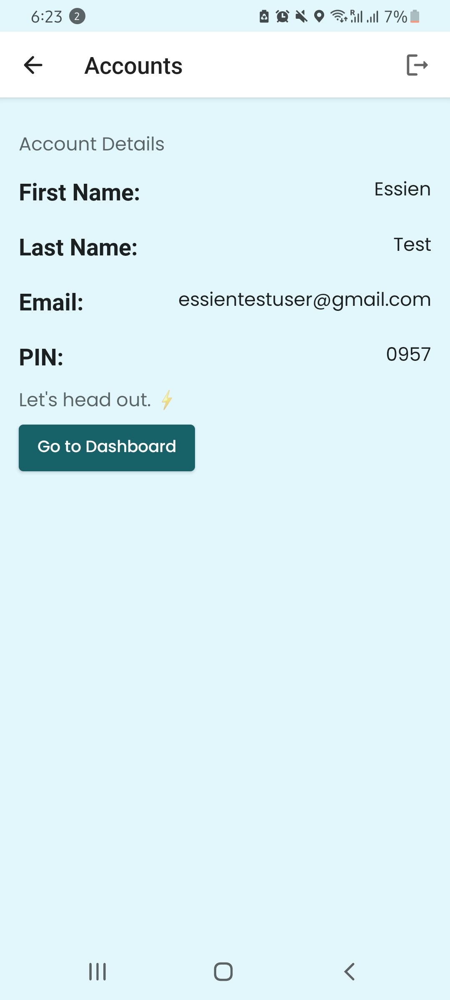
        </td>
        <td>
            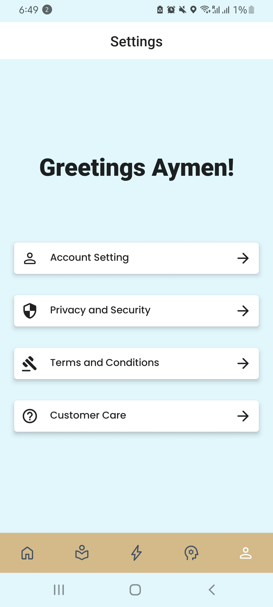
        </td>
         <td>
            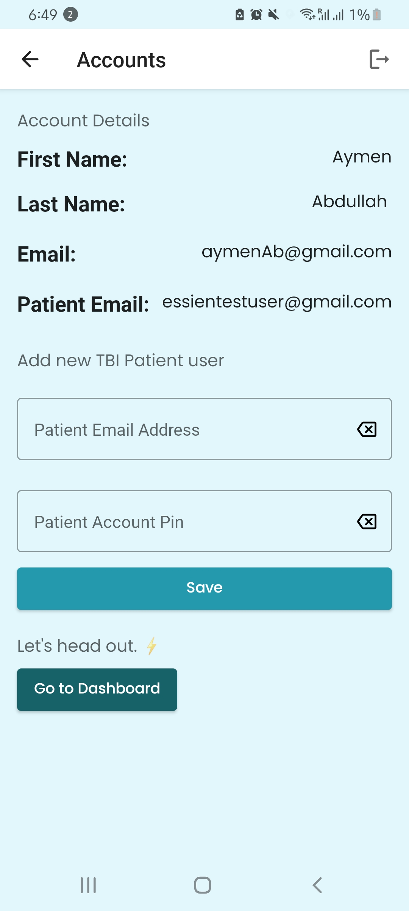
        </td>
    </tr>
</table>

## Downloading the Application

### 1. Using the Application Release .apk

Download the apk file from the github Application release tab at the right hand side of the github
screen. Once downloaded you can email it to yourself and download it on your mobile. If a prompt
about downloading from unknown source is trigger, please allow the accept our application as a non-
threat application and allow for the download to be complete. If a trust dialog message, click
on "not now" to continue with the download. Once the download is done. You will have a standalone
stable build of our application on your mobile.

### 2. Using the IDE tool

Download the source code from the github repository and open Android Studio. In Android studio
change
your gradle project structure to 7.3.1 either going to the project structure settings at **File >
Project structure** or by using the keyboard shortcut Control + Alt + Shift + S on the Visual
Studio Keymap. To change your keymap, open the project settings page at **File > Settings** and
search for keymap. There you can change your keymap to Visual studio.

Once done, download a virtual device to run the application on or you can use USB debugging with
your mobile, for more information on USB debugging visit
[Understanding USB Debugging with Android Studio](https://developer.android.com/studio/run/device).
Once a device is connected, if connected via virtual device ensure that the device is running and
click on the run app button with the virtual device selected for the application to launch on the
device. If connected via USB debug, run the application and it will be installed on your mobile.

## How-to-use guide: TBI Version

## Section A : Daily Dairy Feed

### 1. Creating a conversation summary

Please follow the following steps to create a summarized conversation.

* Step 1: Click on the create button at the top right corner of your screen.
* Step 2: Click on the _conversation summary_ feature.
* Step 3: Type in the name of the person you are having a conversation with.
* Step 4: Click on the "record button" to record the conversation.
* Step 5: Once done click on the "Stop recording button" and finally.
* Step 6: Click the finish button.

### 2. Creating a daily activity

* Step 1: Click on the create button at the top right corner of your screen.
* Step 2: Click on the _Daily Activity_ feature.
* Step 3: Select an image to use from the images directory of your phone.
* Step 4: Enter the location in which this activity was recorded from.
* Step 5: Once done with entries, click on the "Post button" to post the activity to the feed and
  for other users to see(i.e The guardians of the application.)

### 3. Creating an activity through moment snap

* Step 1: Click on the create button at the top right corner of your screen.
* Step 2: Click on the _Moment Snap_ feature.
* Step 3: Take an image using the in-built camera
* Step 4: click the "create activity button" once satisfied with image.
* Step 5: Repeat Step 4 and 5 of the "Create a daily activity".

### 4. View the activity feed and the conversation summary feeds

* Step 1: Go to the second bottom navigation option from the navigation bar.
* Step 2: Once the page is loaded, it is the activity feed tab and conversation summary feed is next
  to it.

### 5. How to Filter the activity feed and the conversation summary

* Step 1: In the daily diary feed screen, at the top right corner before the create button, the
  "Filter button". Click on it a dialog calendar will open.
* Step 2: Select a date to filter from and click "Ok" to confirm the date.
* Step 3: View the filtered activities and conversation summary in the Daily Diary Feed.

## Section B: Side Quest

### 1. Play Side Quest

Pre-requisite: Ensure that you have made an activity or activities.

* Step 1: Click the "Play button" on the Side quest home screen.
* Step 2: For each question, enter the name of the location you entered in when you were making the
  activity.
* Step 3: Once done click on "next button" to submit your answer and move to the next question.
* Step 4: Once complete with answering the questions, a dialog will appear, click on "see results
  button" to view the result and receive feedback on the game.
* Step 5: Once done viewing the results click on the "Finish button" to return back to the side
  quest
  home screen.

### 2. View the side quest result using the "View result button"

* Step 1: In the side quest home screen, click the "View Result button" then filter by date or
  select
  the current date to view the result of the game played.
* Step 2: Click on the "next button" to see other result feedback or "Finish button" to return back
  to
  side quest home screen.
* Step 3: If you reach the end of the result page, the button layout will change to "Finish" only
  therefore you have reached the end of the result page for the game played.

### 3. View the side quest Analysis using the "View Analysis button"

* Step 1: In the side quest home screen, click the "View Analysis button" then filter by date or
  select
  the current date to view the result of the game played.
* Step 2: Allow the analysis bars to calculate the progress and return feedback to you.
* Step 3: Click on the "Finish button" if satisfied with Side Quest analysis.

## Section C: Think Fast

### 1: Play Think fast

* Step 1: Click on the "Play button" in the Think fast home screen.
* Step 2: Go through the rules screen, once done swipe down and you will find the "Play game button"
  .
* Step 3: Click the "Play game button" to begin the exercise. A loading screen will appear, this
  loads
  up the game stage.
* Step 4: Focus on the image for 30 seconds to observe its overall variations. The game began will
  begin once the timer is done.
* Step 5: Answer the questions that are being prompted under the given time of 20 seconds for each
  question.
* Step 6: Once done with the questions, click on the "See result button" on the dialog to view the
  results.

### 2. View the Think fast result using the "View result button"

* Step 1: In the Think fast home screen, click the "View Result button" then filter by date or
  select
  the current date to view the result of the game played.
* Step 2: Click on the "next button" to see other result feedback or "Finish button" to return back
  to
  Think fast home screen.
* Step 3: If you reach the end of the result page, the button layout will change to "Finish" only
  therefore you have reached the end of the result page for the game played.

### 3. View the Think fast Analysis using the "View Analysis button"

* Step 1: In the Think fast home screen, click the "View Analysis button" then filter by date or
  select
  the current date to view the result of the game played.
* Step 2: Allow the analysis bars to calculate the progress and return feedback to you.
* Step 3: Click on the "Finish button" if satisfied with Think fast analysis.

## Section D: Main Settings

### 1. Account Settings

* Step 1: Click on the "Account settings button" to view your account details information.
* Step 2: Once done, click the back button at the top left screen to navigate back or the "Go to
  dashboard" button to return to the dashboard.

### 2. Privacy and Security

* Step 1: Click on the "Privacy and Security button" to view the privacy and security policy of our
  application.
* Step 2: Once done, click on the back button to navigate back to the main settings screen at the
  top right corner of the screen.

### 3. Terms and Conditions

* Step 1: Click on the "Terms and Condition button" to view the T&Cs of our application.
* Step 2: Once done, click on the back button to navigate back to the main settings screen at the
  top right corner of the screen.

### 4. Customer Care

* Step 1: Click on the "Customer" to view the FAQs and Contact button.
    * Step 1a: Once done, click on the back button to navigate back to the main settings screen at
      the
      top right corner of the screen.
* Step 2: Click on the FAQs to view the FAQs of the application.
    * Step 2a: Once done, click on the back button to navigate back to the main settings screen at
      the
      top right corner of the screen.
* Step 3: Click on the Contact to view our various ways to reach out to us, such as Whatsapp,
  Gmail, or Outlook.
    * Step 3a: Once done, click on the back button to navigate back to the main settings screen at
      the
      top right corner of the screen.
